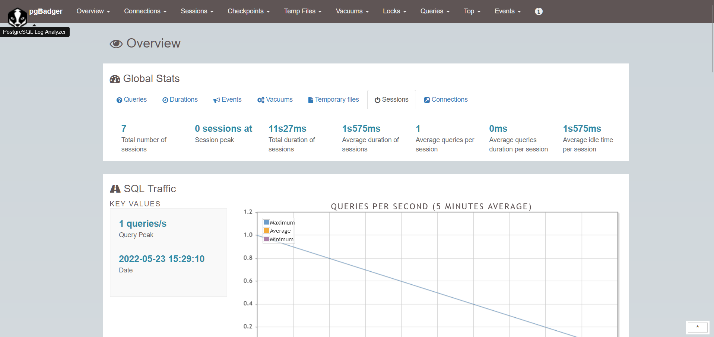

# pouch

🤹 PostgreSQL sandbox for fun. Supports table creation, seed generation, monitoring, backups, sharding and more!

> Wrote this sandbox for playing around with PostgreSQL without touching my local instance.

https://aadhav.me/posts/one-week-postgres/

## Features

- Fuss-free Docker-based setup (Docker Compose)
- Table creation (init scripts)
- Seed generation through `faker` and Python
- Seeding PostgreSQL database through generated seeds and bash script (`seed.sh`)
- Loaders for loading csv data to PostgreSQL database
- Automatic data removal through `TRUNCATE TABLE` and delete script
- Support for backups (`pg_dumpall`)
- Backup removals using Python (_retention policy = 1 week_)
- Monitoring options:
  - PgHero (extensive, use `make pghero`)
  - Prometheus + Grafana + postgres-exporter (minimal, can be found under `monitoring`)
- Makefile for seamless interaction
- Documentation through `tbls` (`make doc`)
- Benchmarks using `pgbench` (`make bench`)
- Log analysis using PgBadger (`make pgbadger`)
- Sharding using Citus (`citus-install.sh`, add to `shared_preload_libraries`, create extension and convert table to distributed table!)

## Screenshots

