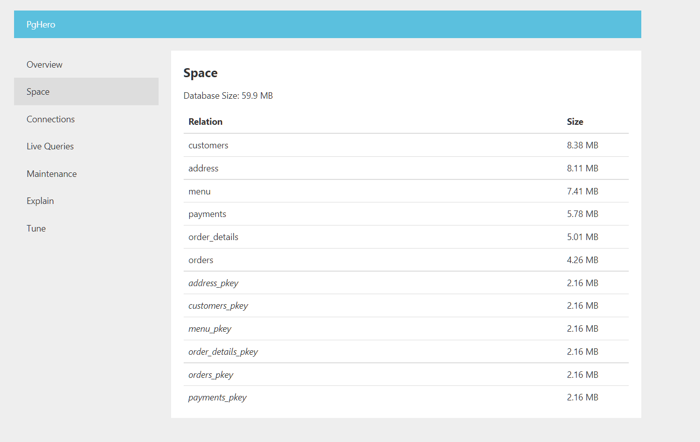

# pouch

My "hacky" way to setup PostgreSQL with mock data.

## Features

- Fuss-free Docker-based setup (Docker Compose)
- Table creation (init scripts)
- Seed generation through `faker` and Python
- Seeding PostgreSQL database through generated seeds and bash script (`seed.sh`)
- Loaders for loading csv data to PostgreSQL database
- Automatic data removal through `TRUNCATE TABLE` and delete script
- Support for backups (`pg_dumpall`)
- Backup removals using Python (_retention policy = 1 week_)
- Monitoring options:
  - PgHero (extensive, use `make pghero`)
  - Prometheus + Grafana + postgres-exporter (minimal, can be found under `monitoring`)
- Makefile for seamless interaction
- Get query execution plans through `make get-plans`
- Documentation through `tbls` (`make doc`)

## Screenshots

