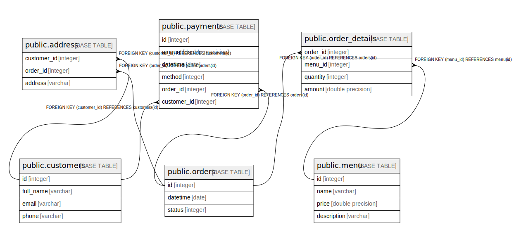

# carroteats

## Tables

| Name | Columns | Comment | Type |
| ---- | ------- | ------- | ---- |
| [public.customers](public.customers.md) | 4 |  | BASE TABLE |
| [public.payments](public.payments.md) | 6 |  | BASE TABLE |
| [public.address](public.address.md) | 3 |  | BASE TABLE |
| [public.orders](public.orders.md) | 3 |  | BASE TABLE |
| [public.order_details](public.order_details.md) | 4 |  | BASE TABLE |
| [public.menu](public.menu.md) | 4 |  | BASE TABLE |

## Relations

---

> Generated by [tbls](https://github.com/k1LoW/tbls)
