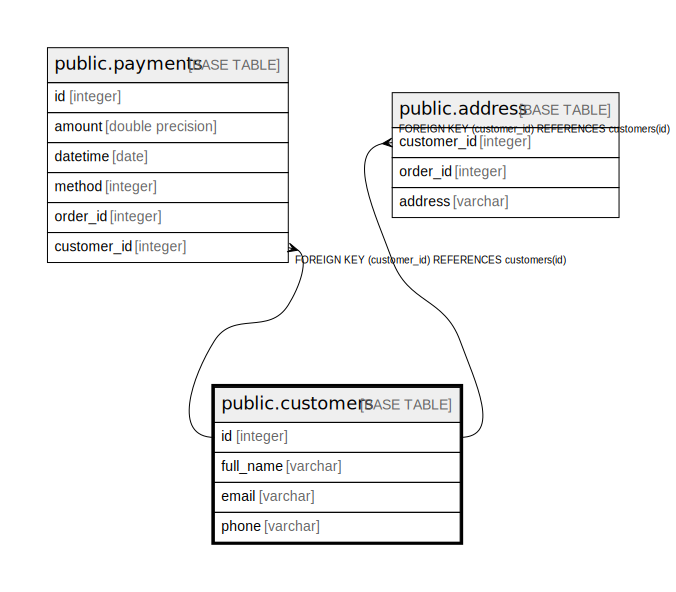

# public.customers

## Description

## Columns

| Name | Type | Default | Nullable | Children | Parents | Comment |
| ---- | ---- | ------- | -------- | -------- | ------- | ------- |
| id | integer | nextval('customers_id_seq'::regclass) | false | [public.payments](public.payments.md) [public.address](public.address.md) |  |  |
| full_name | varchar |  | true |  |  |  |
| email | varchar |  | true |  |  |  |
| phone | varchar |  | true |  |  |  |

## Constraints

| Name | Type | Definition |
| ---- | ---- | ---------- |
| customers_pkey | PRIMARY KEY | PRIMARY KEY (id) |

## Indexes

| Name | Definition |
| ---- | ---------- |
| customers_pkey | CREATE UNIQUE INDEX customers_pkey ON public.customers USING btree (id) |

## Relations

---

> Generated by [tbls](https://github.com/k1LoW/tbls)
