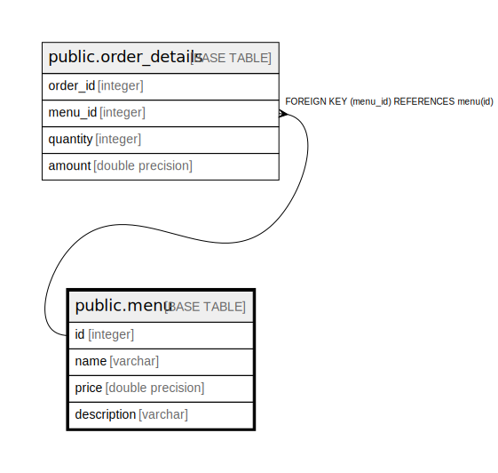

# public.menu

## Description

## Columns

| Name | Type | Default | Nullable | Children | Parents | Comment |
| ---- | ---- | ------- | -------- | -------- | ------- | ------- |
| id | integer | nextval('menu_id_seq'::regclass) | false | [public.order_details](public.order_details.md) |  |  |
| name | varchar |  | true |  |  |  |
| price | double precision |  | true |  |  |  |
| description | varchar |  | true |  |  |  |

## Constraints

| Name | Type | Definition |
| ---- | ---- | ---------- |
| menu_pkey | PRIMARY KEY | PRIMARY KEY (id) |

## Indexes

| Name | Definition |
| ---- | ---------- |
| menu_pkey | CREATE UNIQUE INDEX menu_pkey ON public.menu USING btree (id) |

## Relations

---

> Generated by [tbls](https://github.com/k1LoW/tbls)
