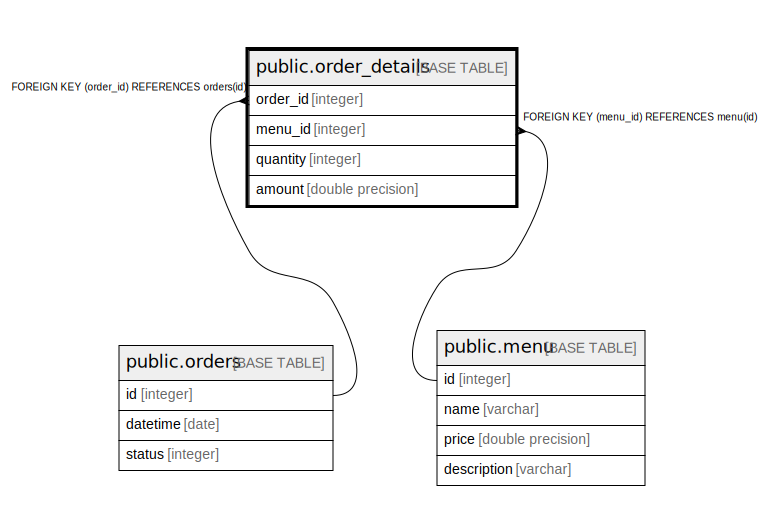

# public.order_details

## Description

## Columns

| Name | Type | Default | Nullable | Children | Parents | Comment |
| ---- | ---- | ------- | -------- | -------- | ------- | ------- |
| order_id | integer |  | false |  | [public.orders](public.orders.md) |  |
| menu_id | integer |  | false |  | [public.menu](public.menu.md) |  |
| quantity | integer |  | true |  |  |  |
| amount | double precision |  | true |  |  |  |

## Constraints

| Name | Type | Definition |
| ---- | ---- | ---------- |
| order_details_order_id_fkey | FOREIGN KEY | FOREIGN KEY (order_id) REFERENCES orders(id) |
| order_details_pkey | PRIMARY KEY | PRIMARY KEY (order_id, menu_id) |
| order_details_menu_id_fkey | FOREIGN KEY | FOREIGN KEY (menu_id) REFERENCES menu(id) |

## Indexes

| Name | Definition |
| ---- | ---------- |
| order_details_pkey | CREATE UNIQUE INDEX order_details_pkey ON public.order_details USING btree (order_id, menu_id) |
| order_id_order_details_idx | CREATE INDEX order_id_order_details_idx ON public.order_details USING btree (order_id) |

## Relations

---

> Generated by [tbls](https://github.com/k1LoW/tbls)
