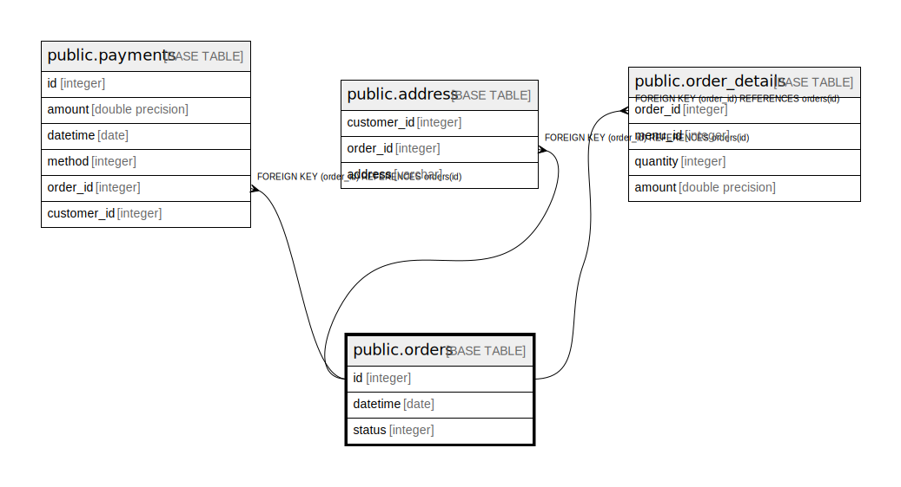

# public.orders

## Description

## Columns

| Name | Type | Default | Nullable | Children | Parents | Comment |
| ---- | ---- | ------- | -------- | -------- | ------- | ------- |
| id | integer | nextval('orders_id_seq'::regclass) | false | [public.payments](public.payments.md) [public.address](public.address.md) [public.order_details](public.order_details.md) |  |  |
| datetime | date |  | true |  |  |  |
| status | integer |  | true |  |  |  |

## Constraints

| Name | Type | Definition |
| ---- | ---- | ---------- |
| orders_pkey | PRIMARY KEY | PRIMARY KEY (id) |

## Indexes

| Name | Definition |
| ---- | ---------- |
| orders_pkey | CREATE UNIQUE INDEX orders_pkey ON public.orders USING btree (id) |

## Relations

---

> Generated by [tbls](https://github.com/k1LoW/tbls)
