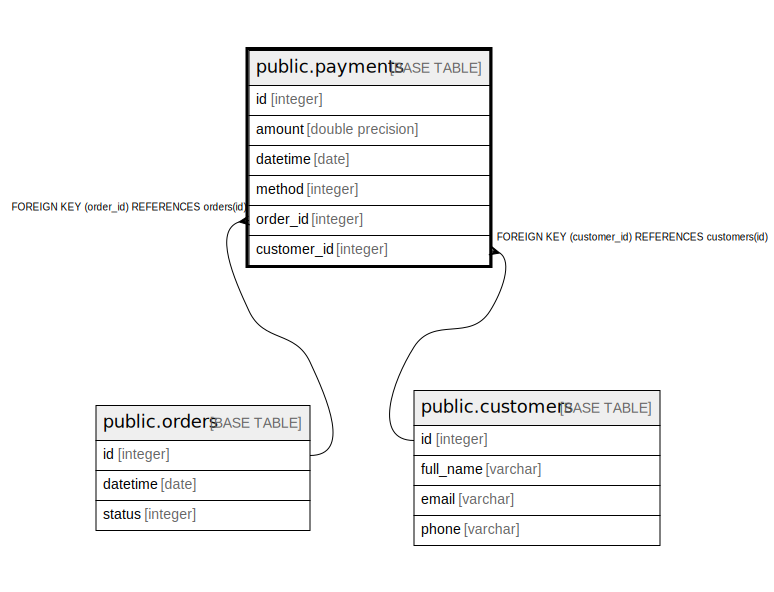

# public.payments

## Description

## Columns

| Name | Type | Default | Nullable | Children | Parents | Comment |
| ---- | ---- | ------- | -------- | -------- | ------- | ------- |
| id | integer | nextval('payments_id_seq'::regclass) | false |  |  |  |
| amount | double precision |  | true |  |  |  |
| datetime | date |  | true |  |  |  |
| method | integer |  | true |  |  |  |
| order_id | integer |  | true |  | [public.orders](public.orders.md) |  |
| customer_id | integer |  | true |  | [public.customers](public.customers.md) |  |

## Constraints

| Name | Type | Definition |
| ---- | ---- | ---------- |
| payments_customer_id_fkey | FOREIGN KEY | FOREIGN KEY (customer_id) REFERENCES customers(id) |
| payments_pkey | PRIMARY KEY | PRIMARY KEY (id) |
| payments_order_id_fkey | FOREIGN KEY | FOREIGN KEY (order_id) REFERENCES orders(id) |

## Indexes

| Name | Definition |
| ---- | ---------- |
| payments_pkey | CREATE UNIQUE INDEX payments_pkey ON public.payments USING btree (id) |

## Relations

---

> Generated by [tbls](https://github.com/k1LoW/tbls)
